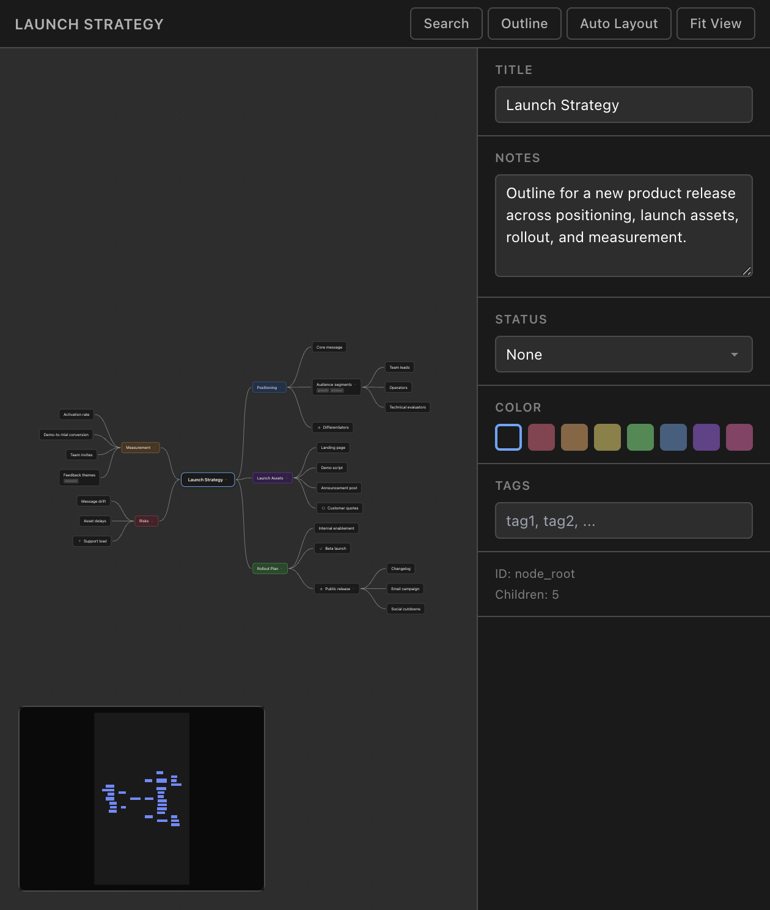

# Nimbalyst Mindmap

Nimbalyst Mindmap is a canvas-first mindmap editor for Nimbalyst. It stores maps as markdown-based `.mindmap` files, so the same document stays readable in plain text, editable in source mode, and usable from AI tooling.



## Highlights

- Freeform spatial editing on an infinite canvas
- Markdown-backed `.mindmap` files with a simple, readable structure
- Outline-style hierarchy plus node metadata, notes, tags, and status
- AI tools and Claude plugin support for creating and editing mindmaps

## File Format

`.mindmap` files are standard markdown with one root heading, optional frontmatter, and nested structure built from headings and lists. See [`examples/`](./examples) and the Claude skill in [`claude-plugin/`](./claude-plugin) for format examples.

## Development

Requirements:

- Node.js 20 or newer
- A compatible Nimbalyst build
- `@nimbalyst/extension-sdk`

Local commands:

```bash
npm install
npm test
npm run build
```

This repository contains the standalone extension source. If you are working from the main Nimbalyst project, use that project's extension build and marketplace publishing workflow.

For extension-specific development notes, see [CLAUDE.md](./CLAUDE.md).

## Repository Layout

- `src/` extension source
- `examples/` sample `.mindmap` files
- `claude-plugin/` Claude command and skill definitions
- `mockups/` screenshots and visual assets

## License

Licensed under the MIT License. See [LICENSE](./LICENSE).
